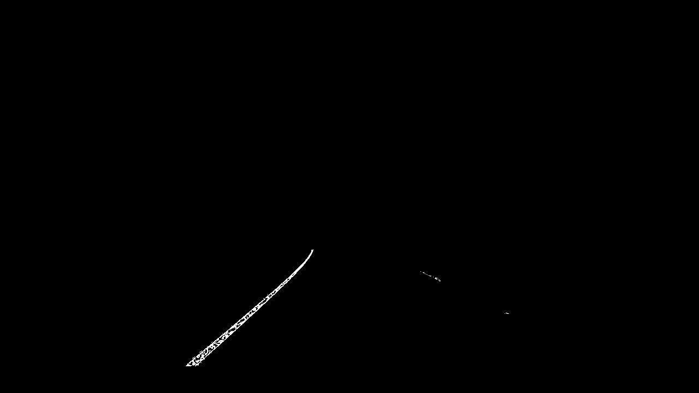
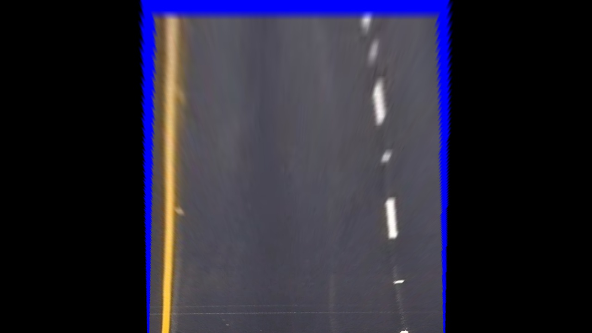
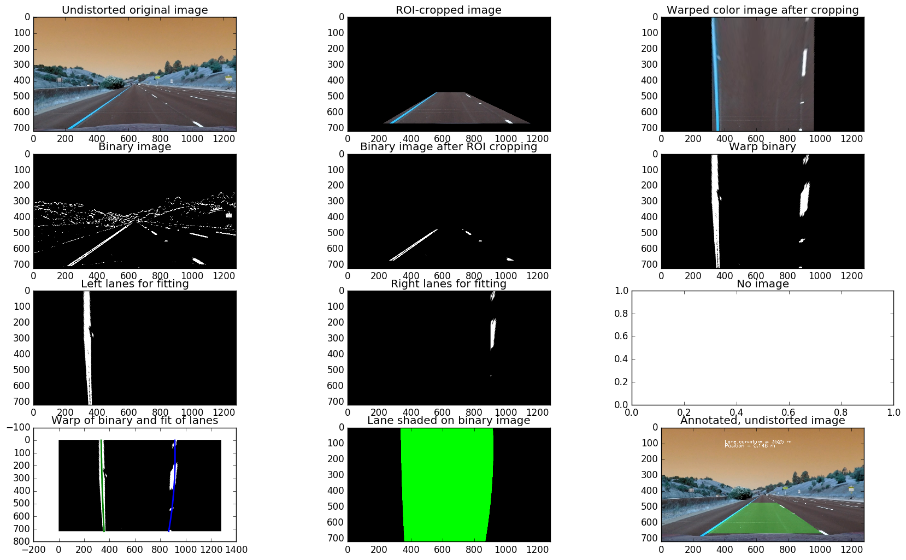
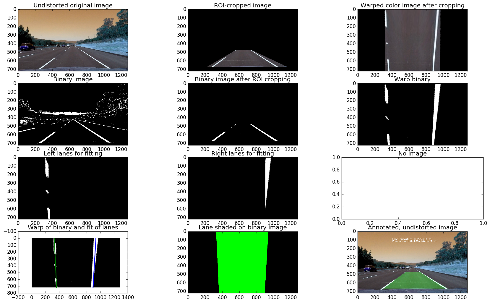
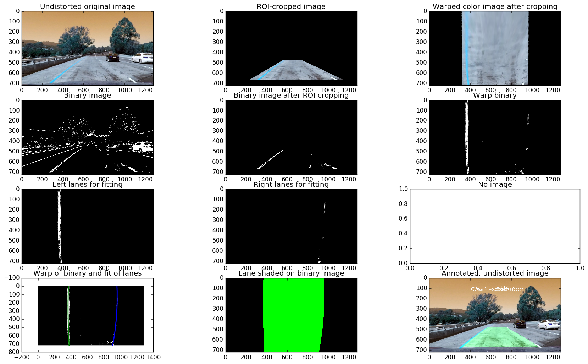
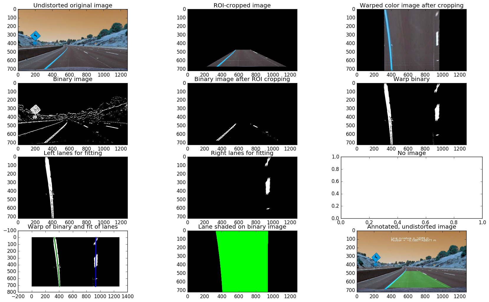
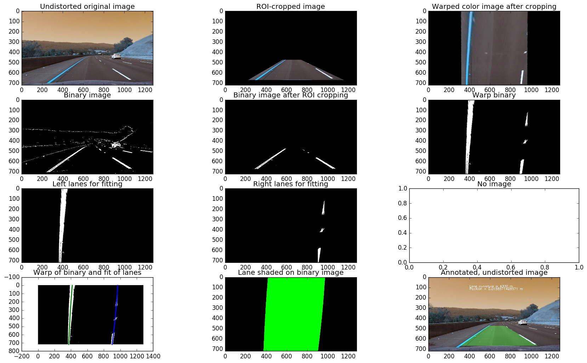
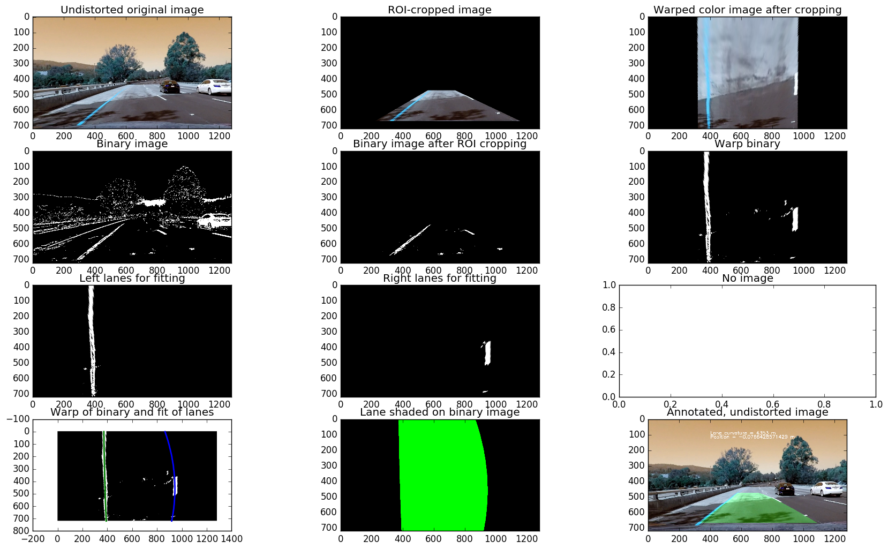
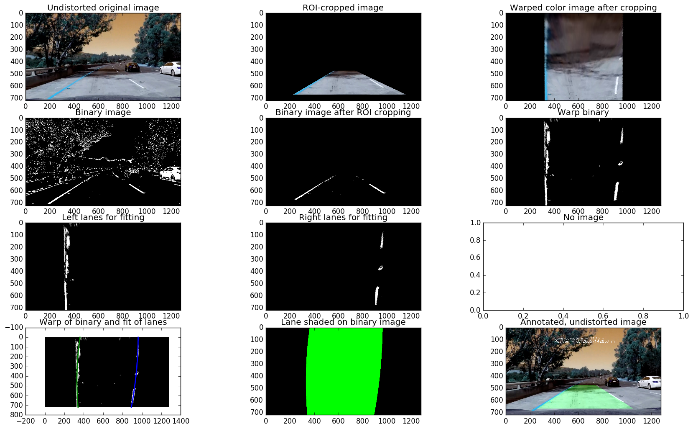
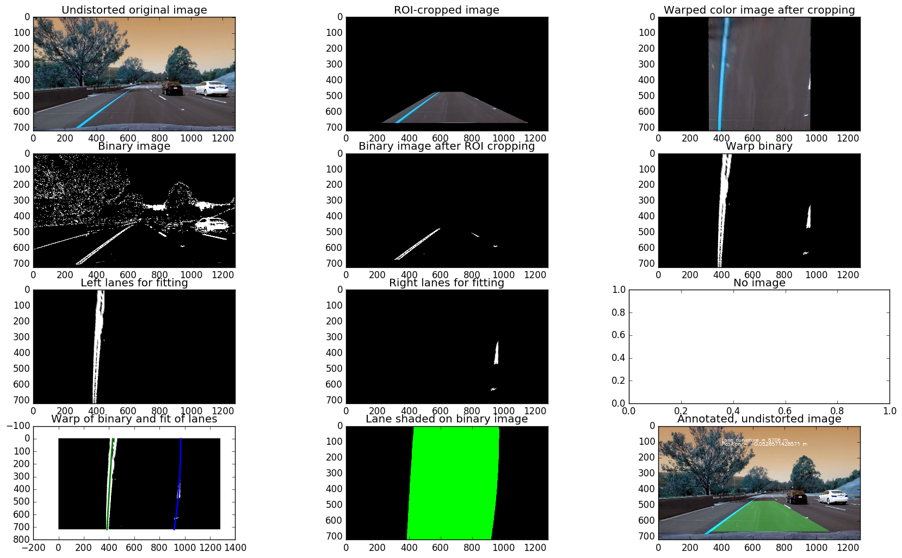

##Udacity Self Driving Car
##Term 1, Project 4
---

**Advanced Lane Finding Project**
The goals / steps of this project are:
* Compute the camera calibration matrix and distortion coefficients given a set of
chessboard images. (DONE)
* Apply a distortion correction to raw images. (DONE)
* Use color transforms, gradients, etc., to create a thresholded binary image. (DONE)
* Apply a perspective transform to rectify binary image ("birds-eye view"). (Not Done)
* Detect lane pixels and fit to find the lane boundary. (Not Done)
* Determine the curvature of the lane and vehicle position with respect to center. (Not Done)
* Warp the detected lane boundaries back onto the original image. (Not Done)
* Output visual display of the lane boundaries and numerical estimation of lane curvature
and vehicle position. (Not Done)

[t1p1_link]: https://github.com/blakejacquot/udacity_SDC_T1P1_LaneFinding/blob/master/P1.ipynb

##[Rubric](https://review.udacity.com/#!/rubrics/571/view) Responses

###Writeup / README

####1. Provide a Writeup / README that includes all the rubric points and how you addressed each one.  You can submit your writeup as markdown or pdf.

You are  reading it.

###Camera Calibration
####1. Briefly state how you computed the camera matrix and distortion coefficients.
The code for this step is in `compute_camera_cal` and `undistort_image` functions from
file `main.py`.

Make 'objpoints', which will hold the x, y, z chessboard coordinates. The variable 'imgpoints'
has the x, y pixel positions for each corner where there was a successful detection.

Use these two variables to compute camera calibration. Driving function is 'cv2.undistort'

Original image

Undistorted image

---
###Pipeline (single images)

####1. Provide an example of a distortion-corrected image.
Read in calibration parameters from pickle file and use `undistort_image` function from
file `main.py`. The undistortion is subtle.

Original image

Undistorted image

####2. Describe how (and identify where in your code) you used color transforms, gradients or other methods to create a thresholded binary image.  Provide an example of a binary image result.
My method borrows heavily from my [first project][t1p1_link] in this course.

The general order of operations is:
1. Grayscale image.
2. Gaussian blur image with kernel of specified size.
3. Apply edge detection.

Code for making binary image is in `make_binary_image` function of file `main.py`.

Here is an example of my output for this step:

Binary image

####3. Describe how (and identify where in your code) you performed a perspective transform and provide an example of a transformed image.

Code for perspective transform includes a function called `warper()` from file `main.py`.
The function `warper()` takes an image parameters calculated from the `get_warp_params`
function. `get_warp_params` calculates the source and destination points for the transform.
Source points are selected to crop the original image to the area containing lanes.

After choosing the source points for the transform, I sanity-checked results by looking at
the resulting region of interest on straight lane lines and the transform of this image.

Undistorted image with source points drawn:

Transformed image:

I used the following source and destination points:

| Source        | Destination   |
|:-------------:|:-------------:|
| 585, 450 tl   | 320, 0        |
| 225, 670 bl   | 320, 720      |
| 1150, 670 br  | 960, 720      |
| 720, 450 tr   | 960, 0        |

tr = top right, bl = bottom left

####4. Describe how (and identify where in your code) you identified lane-line pixels and fit their positions with a polynomial?

To identify lane-line pixels, start with a Hough transformation to ... Next crop the binary
image with Hough lines down to the ROI specified by the perspective transformation.

    img_shape = img.shape
    img_size = (img_shape[1],img_shape[0])
    src, dst = make_src_dst(img_shape)
    img_undistort = undistort_image(objpoints, imgpoints, img)
    img_roi = region_of_interest(img_undistort, src)
    M, Minv = get_warp_params(img, src, dst)
    img_bin = make_binary_image(img_roi)
    img_bin_warp = warper(img_bin, M)
    zero_right, zero_left = zero_left_right(img_bin_warp)
    left_fit_xvals, right_fit_xvals, y_vals, avg_curverad = calc_fit(zero_left, zero_right)
    offset = calc_offset(left_fit_xvals, right_fit_xvals, img_size)
    img_color_warp = shade_lane(img_bin_warp, left_fit_xvals, right_fit_xvals, y_vals)
    newwarp = warper(img_color_warp, Minv)
    img_result = annotate_image(newwarp, img, avg_curverad, offset)

-Do hough transform
-Crop to ROI
-Fit points on left
-Fit points on right

TBD
TBD
TBD
TBD
TBD
TBD
TBD
TBD
TBD
TBD
TBD
TBD

I verified that my perspective transform was working as expected by drawing the `src` and
`dst` points onto a test image and its warped counterpart to verify that the lines appear
parallel in the warped image.

Then I did some other stuff and fit my lane lines with a 2nd order polynomial kinda like
this:

####5. Describe how (and identify where in your code) you calculated the radius of curvature of the lane and the position of the vehicle with respect to center.

I did this in lines # through # in my code in `my_other_file.py`

####6. Provide an example image of your result plotted back down onto the road such that the lane area is identified clearly.

I implemented this step in lines # through # in my code in `yet_another_file.py` in the
function `map_lane()`.  Here is an example of my result on a test image:

      

####6. Examples of pipeline operating on all provided test images.

The entire pipeline is in 'main.py' in 'proc_pipeline' function. Briefly it:

1. Calculates source and destination matrices for warping.
2. Undistorts image.
3. Crops to region of interest.
4. Makes warp parameters.
5. Makes this into binary image.
6. Warps binary image.
7. Fits lanes and calculates curvature.
8. Calculates offset.
9. Shade lane and dewarp.
10. Annotate final image.

Below are examples of running the entire pipeline on the provided test images.

      
      
      
      
      
      
      
      

---

###Pipeline (video)

####1. Provide a link to your final video output.  Your pipeline should perform reasonably well on the entire project video (wobbly lines are ok but no catastrophic failures that would cause the car to drive off the road!).

Here's a [link to my video result](./project_video.mp4)

---

###Discussion

####1. Briefly discuss any problems / issues you faced in your implementation of this project.  Where will your pipeline likely fail?  What could you do to make it more robust?

Here I'll talk about the approach I took, what techniques I used, what worked and why,
where the pipeline might fail and how I might improve it if I were going to pursue this
project further.

